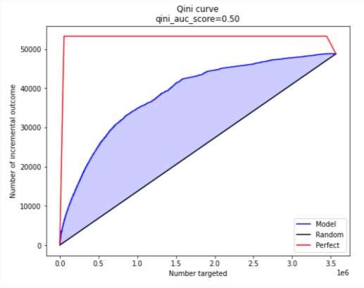

.. -*- mode: rst -*-

|Python3|_ |PyPi|_ |Docs|_ |License|_

.. |Python3| image:: https://img.shields.io/badge/python-3-blue.svg
.. _Python3: https://badge.fury.io/py/scikit-uplift

.. |PyPi| image:: https://badge.fury.io/py/scikit-uplift.svg
.. _PyPi: https://badge.fury.io/py/scikit-uplift

.. |Docs| image:: https://readthedocs.org/projects/scikit-uplift/badge/?version=latest
.. _Docs: https://scikit-uplift.readthedocs.io/en/latest/

.. |License| image:: https://img.shields.io/badge/license-MIT-green
.. _License: https://github.com/maks-sh/scikit-uplift/blob/master/LICENSE

.. |Open In Colab1| image:: https://colab.research.google.com/assets/colab-badge.svg
.. _Open In Colab1: https://colab.research.google.com/github/maks-sh/scikit-uplift/blob/master/notebooks/RetailHero_EN.ipynb

.. |Open In Colab2| image:: https://colab.research.google.com/assets/colab-badge.svg
.. _Open In Colab2: https://colab.research.google.com/github/maks-sh/scikit-uplift/blob/master/notebooks/RetailHero.ipynb

.. |Open In Colab3| image:: https://colab.research.google.com/assets/colab-badge.svg
.. _Open In Colab3: https://colab.research.google.com/github/maks-sh/scikit-uplift/blob/master/notebooks/pipeline_usage_EN.ipynb

.. |Open In Colab4| image:: https://colab.research.google.com/assets/colab-badge.svg
.. _Open In Colab4: https://colab.research.google.com/github/maks-sh/scikit-uplift/blob/master/notebooks/pipeline_usage_RU.ipynb

.. _scikit-uplift.readthedocs.io: https://scikit-uplift.readthedocs.io/en/latest/

.. image:: https://raw.githubusercontent.com/maks-sh/scikit-uplift/dev/docs/_static/sklift-github-logo.png
    :align: center
    :alt: scikit-uplift: uplift modeling in scikit-learn style in python

scikit-uplift
===============

**scikit-uplift** is a Python module for classic approaches for uplift modeling built on top of scikit-learn.

Uplift prediction aims to estimate the causal impact of a treatment at the individual level.

Read more about uplift modeling problem in `User Guide <https://scikit-uplift.readthedocs.io/en/latest/user_guide/index.html>`__,
also articles in russian on habr.com: `Part 1 <https://habr.com/ru/company/ru_mts/blog/485980/>`__
and `Part 2 <https://habr.com/ru/company/ru_mts/blog/485976/>`__.

**Features**:

* Comfortable and intuitive style of modelling like scikit-learn;

* Applying any estimator adheres to scikit-learn conventions;

* All approaches can be used in sklearn.pipeline (see example (`EN <https://nbviewer.jupyter.org/github/maks-sh/scikit-uplift/blob/master/notebooks/pipeline_usage_EN.ipynb>`__ |Open In Colab3|_, `RU <https://nbviewer.jupyter.org/github/maks-sh/scikit-uplift/blob/master/notebooks/pipeline_usage_RU.ipynb>`__ |Open In Colab4|_));

* Almost all implemented approaches solve both the problem of classification and regression;

* A lot of metrics (Such as *Area Under Uplift Curve* or *Area Under Qini Curve*) are implemented to evaluate your uplift model;

* Useful graphs for analyzing the built model.

Installation
-------------

**Install** the package by the following command from PyPI:

.. code-block:: bash

    pip install scikit-uplift

Or install from source:

.. code-block:: bash

    git clone https://github.com/maks-sh/scikit-uplift.git
    cd scikit-uplift
    python setup.py install

Documentation
--------------

The full documentation is available at `scikit-uplift.readthedocs.io`_.

Or you can build the documentation locally using `Sphinx <http://sphinx-doc.org/>`_ 1.4 or later:

.. code-block:: bash

    cd docs
    pip install -r requirements.txt
    make html

And if you now point your browser to ``_build/html/index.html``, you should see a documentation site.

Quick Start
-----------

See the **RetailHero tutorial notebook** (`EN <https://nbviewer.jupyter.org/github/maks-sh/scikit-uplift/blob/master/notebooks/RetailHero_EN.ipynb>`__ |Open In Colab1|_, `RU <https://nbviewer.jupyter.org/github/maks-sh/scikit-uplift/blob/master/notebooks/RetailHero.ipynb>`__ |Open In Colab2|_) for details.

**Train and predict uplift model**

.. code-block:: python

    # import approaches
    from sklift.models import SoloModel, ClassTransformation, TwoModels
    # import any estimator adheres to scikit-learn conventions.
    from catboost import CatBoostClassifier

    # define models
    treatment_model = CatBoostClassifier(iterations=50, thread_count=3,
                                         random_state=42, silent=True)
    control_model = CatBoostClassifier(iterations=50, thread_count=3,
                                       random_state=42, silent=True)

    # define approach
    tm = TwoModels(treatment_model, control_model, method='vanilla')
    # fit model
    tm = tm.fit(X_train, y_train, treat_train)

    # predict uplift
    uplift_preds = tm.predict(X_val)

**Evaluate your uplift model**

.. code-block:: python

    # import metrics to evaluate your model
    from sklift.metrics import (
        uplift_at_k, uplift_auc_score, qini_auc_score, weighted_average_uplift
    )

    # Uplift@30%
    tm_uplift_at_k = uplift_at_k(y_true=y_val, uplift=uplift_preds, treatment=treat_val,
                                 strategy='overall', k=0.3)

    # Area Under Qini Curve
    tm_qini_auc = qini_auc_score(y_true=y_val, uplift=uplift_preds, treatment=treat_val)

    # Area Under Uplift Curve
    tm_uplift_auc = uplift_auc_score(y_true=y_val, uplift=uplift_preds, treatment=treat_val)

    # Weighted average uplift
    tm_wau = weighted_average_uplift(y_true=y_val, uplift=uplift_preds,  treatment=treat_val)

**Vizualize the results**

.. code-block:: python

    # import vizualisation tools
    from sklift.viz import plot_qini_curve

    plot_qini_curve(y_true=y_val, uplift=uplift_preds, treatment=treat_val)

Development
-----------

We welcome new contributors of all experience levels.

- Please see our `Contributing Guide <https://scikit-uplift.readthedocs.io/en/latest/contributing.html>`_ for more details.
- By participating in this project, you agree to abide by its `Code of Conduct <https://github.com/maks-sh/scikit-uplift/blob/master/.github/CODE_OF_CONDUCT.md>`__.

Contributing
~~~~~~~~~~~~~~~

.. image:: https://sourcerer.io/fame/maks-sh/maks-sh/scikit-uplift/images/0
   :target: https://sourcerer.io/fame/maks-sh/maks-sh/scikit-uplift/links/0
   :alt: Top contributor 1

.. image:: https://sourcerer.io/fame/maks-sh/maks-sh/scikit-uplift/images/1
   :target: https://sourcerer.io/fame/maks-sh/maks-sh/scikit-uplift/links/1
   :alt: Top contributor 2

.. image:: https://sourcerer.io/fame/maks-sh/maks-sh/scikit-uplift/images/2
   :target: https://sourcerer.io/fame/maks-sh/maks-sh/scikit-uplift/links/2
   :alt: Top contributor 3

.. image:: https://sourcerer.io/fame/maks-sh/maks-sh/scikit-uplift/images/3
   :target: https://sourcerer.io/fame/maks-sh/maks-sh/scikit-uplift/links/3
   :alt: Top contributor 4

.. image:: https://sourcerer.io/fame/maks-sh/maks-sh/scikit-uplift/images/4
   :target: https://sourcerer.io/fame/maks-sh/maks-sh/scikit-uplift/links/4
   :alt: Top contributor 5

.. image:: https://sourcerer.io/fame/maks-sh/maks-sh/scikit-uplift/images/5
   :target: https://sourcerer.io/fame/maks-sh/maks-sh/scikit-uplift/links/5
   :alt: Top contributor 6

.. image:: https://sourcerer.io/fame/maks-sh/maks-sh/scikit-uplift/images/6
   :target: https://sourcerer.io/fame/maks-sh/maks-sh/scikit-uplift/links/6
   :alt: Top contributor 7

.. image:: https://sourcerer.io/fame/maks-sh/maks-sh/scikit-uplift/images/7
   :target: https://sourcerer.io/fame/maks-sh/maks-sh/scikit-uplift/links/7
   :alt: Legend

Important links
~~~~~~~~~~~~~~~

- Official source code repo: https://github.com/maks-sh/scikit-uplift/
- Issue tracker: https://github.com/maks-sh/scikit-uplift/issues
- Documentation: https://scikit-uplift.readthedocs.io/en/latest/
- User Guide: https://scikit-uplift.readthedocs.io/en/latest/user_guide/index.html
- Contributing guide: https://scikit-uplift.readthedocs.io/en/latest/contributing.html
- Release History: https://scikit-uplift.readthedocs.io/en/latest/changelog.html

===============

Papers and materials
---------------------
1. Gutierrez, P., & Gérardy, J. Y.
	Causal Inference and Uplift Modelling: A Review of the Literature.
	In International Conference on Predictive Applications and APIs (pp. 1-13).

2. Artem Betlei, Criteo Research; Eustache Diemert, Criteo Research; Massih-Reza Amini, Univ. Grenoble Alpes
	Dependent and Shared Data Representations improve Uplift Prediction in Imbalanced Treatment Conditions
	FAIM'18 Workshop on CausalML.

3. Eustache Diemert, Artem Betlei, Christophe Renaudin, and Massih-Reza Amini. 2018.
    A Large Scale Benchmark for Uplift Modeling.
    In Proceedings of AdKDD & TargetAd (ADKDD’18). ACM, New York, NY, USA, 6 pages.

4. Athey, Susan, and Imbens, Guido. 2015.
    Machine learning methods for estimating heterogeneous causal effects.
    Preprint, arXiv:1504.01132. Google Scholar.

5. Oscar Mesalles Naranjo. 2012.
    Testing a New Metric for Uplift Models.
    Dissertation Presented for the Degree of MSc in Statistics and Operational Research.

6. Kane, K., V. S. Y. Lo, and J. Zheng. 2014.
    Mining for the Truly Responsive Customers and Prospects Using True-Lift Modeling:
    Comparison of New and Existing Methods.
    Journal of Marketing Analytics 2 (4): 218–238.

7. Maciej Jaskowski and Szymon Jaroszewicz.
    Uplift modeling for clinical trial data.
    ICML Workshop on Clinical Data Analysis, 2012.

8. Lo, Victor. 2002.
    The True Lift Model - A Novel Data Mining Approach to Response Modeling in Database Marketing.
    SIGKDD Explorations. 4. 78-86.

9. Zhao, Yan & Fang, Xiao & Simchi-Levi, David. 2017.
    Uplift Modeling with Multiple Treatments and General Response Types. 10.1137/1.9781611974973.66.

10. Nicholas J Radcliffe. 2007.
	Using control groups to target on predicted lift: Building and assessing uplift model. Direct Marketing Analytics Journal, (3):14–21, 2007.

11. Devriendt, F., Guns, T., & Verbeke, W. 2020.
	Learning to rank for uplift modeling. ArXiv, abs/2002.05897.

===============

Tags
~~~~~~~~~~~~~~~
**EN**: uplift modeling, uplift modelling, causal inference, causal effect, causality, individual treatment effect, true lift, net lift, incremental modeling

**RU**: аплифт моделирование, Uplift модель

**ZH**: 隆起建模,因果推断,因果效应,因果关系,个人治疗效应,真正的电梯,净电梯

