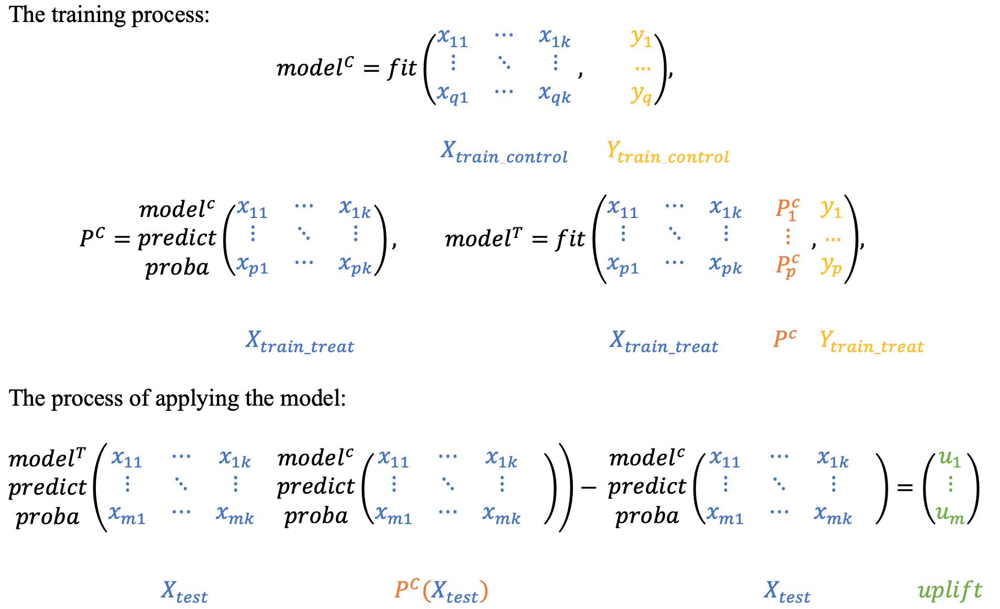

************************
Models (sklift.models)
************************

1. Approaches with the same model
##################################

1.1 One model with treatment as feature
***************************************

The simplest and most intuitive solution: the model is trained on union of two groups, with the binary
communication flag acting as an additional feature. Each object from the test sample is scored twice:
with the communication flag equal to `1` and equal to `0`. Subtracting the probabilities for each observation,
we get the required uplift.

.. image:: ../_static/images/SoloModel.png
    :align: center
    :alt: Solo model dummy method

.. hint::
    In sklift this approach corresponds to the `SoloModel` class and the **dummy** method.

This approach has various modifications. For example, double the number of attributes by adding
the product of each attribute to the interaction flag:

.. image:: ../_static/images/SoloModel_treatment_intercation.png
    :align: center
    :alt: Solo model treatment interaction method

.. hint::
    In sklift this approach corresponds to the `SoloModel` class and the **treatment_interaction** method.

.. autoclass:: sklift.models.models.SoloModel
    :members:

1.2 Class Transformation
*************************

.. warning::
    This approach is only suitable for classification problem

Quite an interesting and mathematically confirmed approach to the construction of the model, presented back in 2012.
The method is to predict a slightly changed target:

.. math::
    z_i = y_i * w_i + (1 - y_i) * (1 - w_i), где

* :math:`z_i` - new target for :math:`i` customer;

* :math:`y_i` - old target :math:`i` customer;

* :math:`w_i` - treatment flag :math:`i` customer.

In other words, the new class is 1 if we know that on a particular observation, the result in the interaction
would be as good as in the control group if we could know the result in both groups:

.. math::
    z_i = \begin{cases}
        1, & \mbox{if } w_i = 1 \mbox{ and } y_i = 1 \\
        1, & \mbox{if } w_i = 0 \mbox{ and } y_i = 0 \\
        0, & \mbox{otherwise}
       \end{cases}

Let's describe in more detail what is the probability of a new target variable:

.. math::
    P(Z=1|X_1, ..., X_m) = \\
    = P(Z=1|X_1, ..., X_m, W = 1) * P(W = 1|X_1, ..., X_m, ) + \\
    + P(Z=1|X_1, ..., X_m, W = 0) * P(W = 0|X_1, ..., X_m, ) = \\
    = P(Y=1|X_1, ..., X_m, W = 1) * P(W = 1|X_1, ..., X_m, ) + \\
    + P(Y=0|X_1, ..., X_m, W = 0) * P(W = 0|X_1, ..., X_m, ).

We assume that :math:`W` does not depend on the attributes of :math:`X_1, ..., X_m`, because otherwise the experiment
design is not very well designed. Taking this, we have: :math:`P(W | X_1, ..., X_m, ) = P(W)` and

.. math::
    P(Z=1|X_1, ..., X_m) = \\
    = P^T(Y=1|X_1, ..., X_m) * P(W = 1) + \\
    + P^C(Y=0|X_1, ..., X_m) * P(W = 0).

Also assume that :math:`P(W = 1) = P(W = 0) = \frac{1}{2}`, i.e. during the experiment, the control and treatment groups
were divided in equal proportions. Then we get the following:

.. math::
    P(Z=1|X_1, ..., X_m) = \\
    = P^T(Y=1|X_1, ..., X_m) * \frac{1}{2} + P^C(Y=0|X_1, ..., X_m) *\frac{1}{2} \Rightarrow \\
    \Rightarrow 2 * P(Z=1|X_1, ..., X_m) = \\
    = P^T(Y=1|X_1, ..., X_m) + P^C(Y=0|X_1, ..., X_m) = \\
    = P^T(Y=1|X_1, ..., X_m) + 1 - P^C(Y=1|X_1, ..., X_m) \Rightarrow \\
    \Rightarrow P^T(Y=1|X_1, ..., X_m) - P^C(Y=1|X_1, ..., X_m) = \\
     = UPLIFT = 2 * P(Z=1|X_1, ..., X_m) - 1

Thus, by doubling the forecast of the new target and subtracting one from it, we get the value of the uplift itself,
i.e.

.. math::
    UPLIFT = 2 * P(Z=1) - 1

Based on the assumption described above: :math:`P(W = 1) = P(W = 0) = \frac{1}{2}`, this approach should be used
only in cases where the number of clients with whom we have communicated is equal to the number of clients with
whom there was no communication.

.. autoclass:: sklift.models.models.ClassTransformation
    :members:

2. Approaches with two models
##############################

.. _in the scikit-learn documentation: https://scikit-learn.org/stable/modules/calibration.html

The two-model approach can be found in almost any uplift modeling work, and is often used as a baseline.
However, the use of two models can lead to some unpleasant consequences: if the training will be used fundamentally
different models or the nature of the data of the test and control groups will be very different,
then the returned models will not be comparable with each other. As a result, the calculation of the uplift will
not be completely correct. To avoid this effect, it is necessary to calibrate the models so that their scores can be
interpolated as probabilities. Calibration of model probabilities is well described `in the scikit-learn documentation`_.

2.1 Two independent models
****************************

.. hint::
    In sklift this approach corresponds to the `TwoModels` class and the **vanilla** method.

As the name implies, the approach is to model the conditional probabilities of the treatment and control groups
separately. The articles argue that this approach is rather weak, since both models focus on predicting the result
separately and can therefore skip the "weaker" differences in the samples.

.. image:: ../_static/images/TwoModels_vanila.png
    :align: center
    :alt: Two independent models vanila

2.2 Two dependent models
*************************

The dependent data representation approach is based on the classifier chain method originally developed
for multi-class classification problems. The idea is that if there are :math:`L` different labels, you can build
:math:`L` different classifiers, each of which solves the problem of binary classification and in the learning process,
each subsequent classifier uses the predictions of the previous ones as additional features.
The authors of this method proposed to use the same idea to solve the problem of uplift modeling in two stages.

.. hint::
    In sklift this approach corresponds to the `TwoModels` class and the **ddr_control** method.

At the beginning we train the classifier based on control data:

.. math::
    P^C = P(Y=1| X, W = 0),

then we will perform the :math:`P_C` predictions as a new feature for training the second classifier on test data,
thus effectively introducing a dependency between the two data sets:

.. math::
    P^T = P(Y=1| X, P_C(X), W = 1)

To get the uplift for each observation, calculate the difference:

.. math::
    uplift(x_i) = P^T (x_i, P_C(x_i)) - P^C(x_i)

Intuitively, the second classifier studies the difference between the expected result in the test and the control, i.e.
the uplift itself.

Similarly, you can first train the :math:`P_T` classifier and then use its predictions as a trait for
the :math:`P_C` classifier.

.. hint::
    In sklift this approach corresponds to the `TwoModels` class and the **ddr_treatment** method.

.. autoclass:: sklift.models.models.TwoModels
    :members: