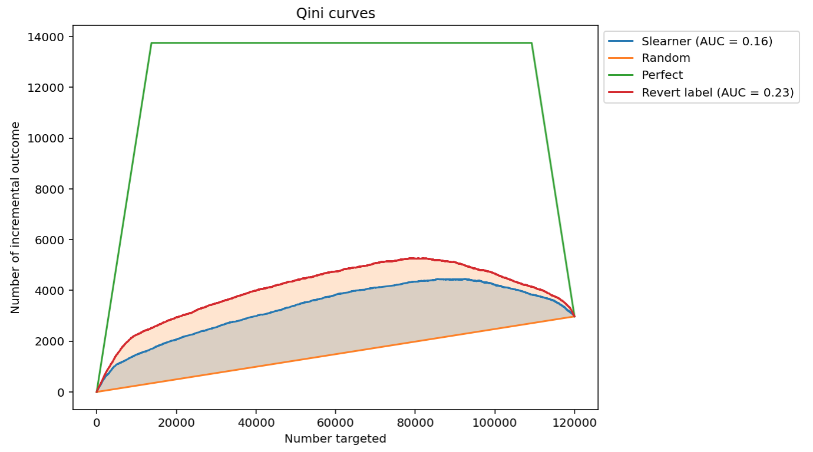
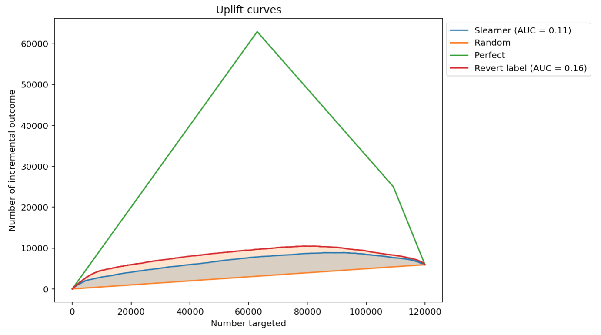
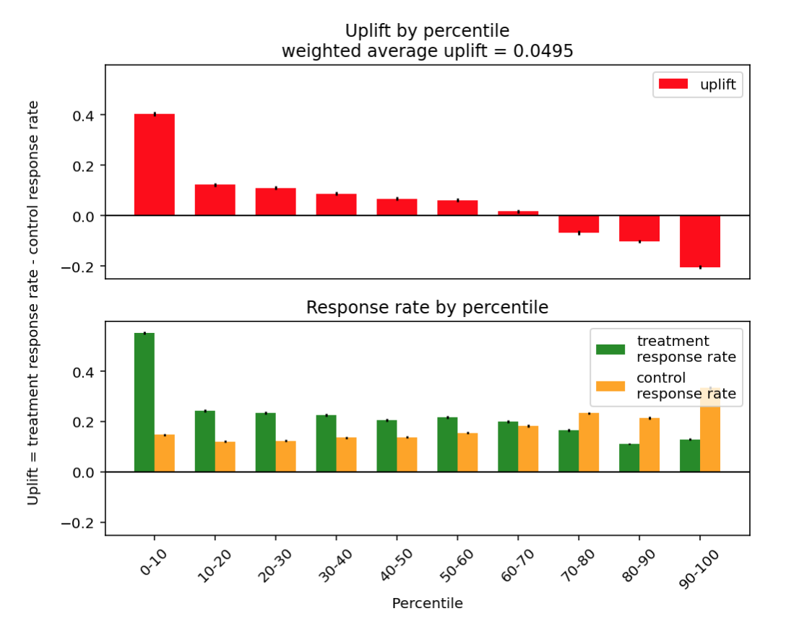

.. _RU: https://nbviewer.jupyter.org/github/maks-sh/scikit-uplift/blob/master/notebooks/RetailHero.ipynb
.. _EN: https://nbviewer.jupyter.org/github/maks-sh/scikit-uplift/blob/master/notebooks/RetailHero_EN.ipynb

.. |Open In Colab1| image:: https://colab.research.google.com/assets/colab-badge.svg
.. _Open In Colab1: https://colab.research.google.com/github/maks-sh/scikit-uplift/blob/master/notebooks/RetailHero_EN.ipynb

.. |Open In Colab2| image:: https://colab.research.google.com/assets/colab-badge.svg
.. _Open In Colab2: https://colab.research.google.com/github/maks-sh/scikit-uplift/blob/master/notebooks/RetailHero.ipynb

***********
Quick Start
***********

See the **RetailHero tutorial notebook** (`EN`_ |Open In Colab1|_, `RU`_ |Open In Colab2|_) for details.

Train and predict your uplift model
====================================

Use the intuitive python API to train uplift models.

.. code-block:: python
    :linenos:

    # import approaches
    from sklift.models import SoloModel, ClassTransformation, TwoModels
    # import any estimator adheres to scikit-learn conventions.
    from catboost import CatBoostClassifier

    # define models
    treatment_model = CatBoostClassifier(iterations=50, thread_count=3,
                                         random_state=42, silent=True)
    control_model = CatBoostClassifier(iterations=50, thread_count=3,
                                       random_state=42, silent=True)

    # define approach
    tm = TwoModels(treatment_model, control_model, method='vanilla')
    # fit model
    tm = tm.fit(X_train, y_train, treat_train)

    # predict uplift
    uplift_preds = tm.predict(X_val)

Evaluate your uplift model
===========================

.. code-block:: python
    :linenos:

    # import metrics to evaluate your model
    from sklift.metrics import (
        uplift_at_k, uplift_auc_score, qini_auc_score, weighted_average_uplift
    )

    # Uplift@30%
    tm_uplift_at_k = uplift_at_k(y_true=y_val, uplift=uplift_preds,
                                 treatment=treat_val,
                                 strategy='overall', k=0.3)

    # Area Under Qini Curve
    tm_qini_auc = qini_auc_score(y_true=y_val, uplift=uplift_preds,
                                 treatment=treat_val)

    # Area Under Uplift Curve
    tm_uplift_auc = uplift_auc_score(y_true=y_val, uplift=uplift_preds,
                                     treatment=treat_val)

    # Weighted average uplift
    tm_wau = weighted_average_uplift(y_true=y_val, uplift=uplift_preds,
                                     treatment=treat_val)

Vizualize the results
======================

.. code-block:: python
    :linenos:

    from sklift.viz import plot_qini_curve

    plot_qini_curve(y_true=y_val, uplift=uplift_preds, treatment=treat_val, negative_effect=True)

.. code-block:: python
    :linenos:

    from sklift.viz import plot_uplift_curve

    plot_uplift_curve(y_true=y_val, uplift=uplift_preds, treatment=treat_val)

.. code-block:: python
    :linenos:

    from sklift.viz import plot_uplift_by_percentile

    plot_uplift_by_percentile(y_true=y_val, uplift=uplift_preds,
                              treatment=treat_val, kind='bar')

