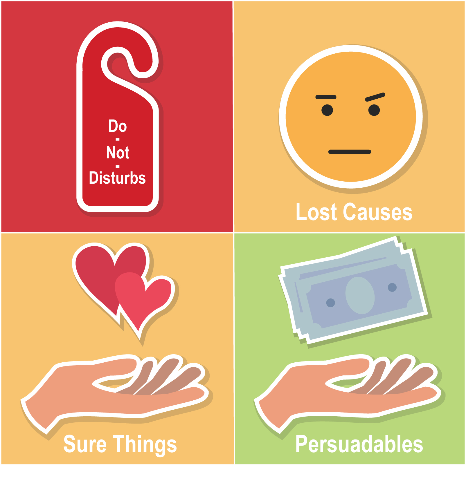

******************************************
Types of customers
******************************************

We can determine 4 types of customers based on a response to a treatment:

- :guilabel:`Do-Not-Disturbs` *(a.k.a. Sleeping-dogs)* have a strong negative response to a marketing communication. They are going to purchase if *NOT* treated and will *NOT* purchase *IF* treated. It is not only a wasted marketing budget but also a negative impact. For instance, customers targeted could result in rejecting current products or services. In terms of math: :math:`W_i = 1, Y_i = 0` or :math:`W_i = 0, Y_i = 1`.
- :guilabel:`Lost Causes` will *NOT* purchase the product *NO MATTER* they are contacted or not. The marketing budget in this case is also wasted because it has no effect. In terms of math: :math:`W_i = 1, Y_i = 0` or :math:`W_i = 0, Y_i = 0`.
- :guilabel:`Sure Things` will purchase *ANYWAY* no matter they are contacted or not. There is no motivation to spend the budget because it also has no effect. In terms of math: :math:`W_i = 1, Y_i = 1` or :math:`W_i = 0, Y_i = 1`.
- :guilabel:`Persuadables` will always respond *POSITIVE* to the marketing communication. They is going to purchase *ONLY* if contacted (or sometimes they purchase *MORE* or *EARLIER* only if contacted). This customer's type should be the only target for the marketing campaign. In terms of math: :math:`W_i = 0, Y_i = 0` or :math:`W_i = 1, Y_i = 1`.

Because we can't communicate and not communicate with the customer at the same time, we will never be able to observe exactly which type a particular customer belongs to.

Depends on the product characteristics and the customer base structure some types may be absent. In addition, a customer response depends heavily on various characteristics of the campaign, such as a communication channel or a type and a size of the marketing offer. To maximize profit, these parameters should be selected.

Thus, when predicting uplift score and selecting a segment by the highest score, we are trying to find the only one type: **persuadables**.

References
==========

1️⃣ Kane, K., V. S. Y. Lo, and J. Zheng. Mining for the Truly Responsive Customers and Prospects Using True-Lift Modeling: Comparison of New and Existing Methods. Journal of Marketing Analytics 2 (4): 218–238. 2014.

2️⃣ Verbeke, Wouter & Baesens, Bart & Bravo, Cristián. (2018). Profit Driven Business Analytics: A Practitioner's Guide to Transforming Big Data into Added Value.