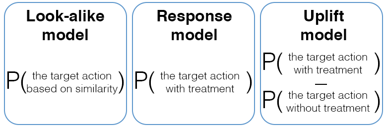

****************************
Uplift vs other models
****************************

Companies use various channels to promote a product to a customer: it can be SMS, push notification, chatbot message in social networks, and many others.
There are several ways to use machine learning to select customers for a marketing campaign:

- :guilabel:`The Look-alike model` (or Positive Unlabeled Learning) evaluates a probability that the customer is going to accomplish a target action. A training dataset contains known positive objects (for instance, users who have installed an app) and random negative objects (a random subset of all other customers who have not installed the app). The model searches for customers who are similar to those who made the target action.
- :guilabel:`The Response model` evaluates the probability that the customer is going to accomplish the target action if there was a communication (a.k.a treatment). In this case the training dataset is data collected after some interaction with the customers. In contrast to the first approach, we have confirmed positive and negative observations at our disposal (for instance, the customer who decides to issue a credit card or to decline an offer).
- :guilabel:`The Uplift model` evaluates the net effect of communication by trying to select only those customers who are going to perform the target action only when there is some advertising exposure presenting to them. The model predicts a difference between the customer's behavior when there is a treatment (communication) and when there is no treatment (no communication).

When should we use uplift modeling?

Uplift modeling is used when the customer's target action is likely to happen without any communication.
For instance, we want to promote a popular product but we don't want to spend our marketing budget on customers who will buy the product anyway with or without communication.
If the product is not popular and it is has to be promoted to be bought, then a task turns to the response modeling task.

References
==========

1️⃣ Radcliffe, N.J. (2007). Using control groups to target on predicted lift: Building and assessing uplift model. Direct Market J Direct Market Assoc Anal Council, 1:14–21, 2007.