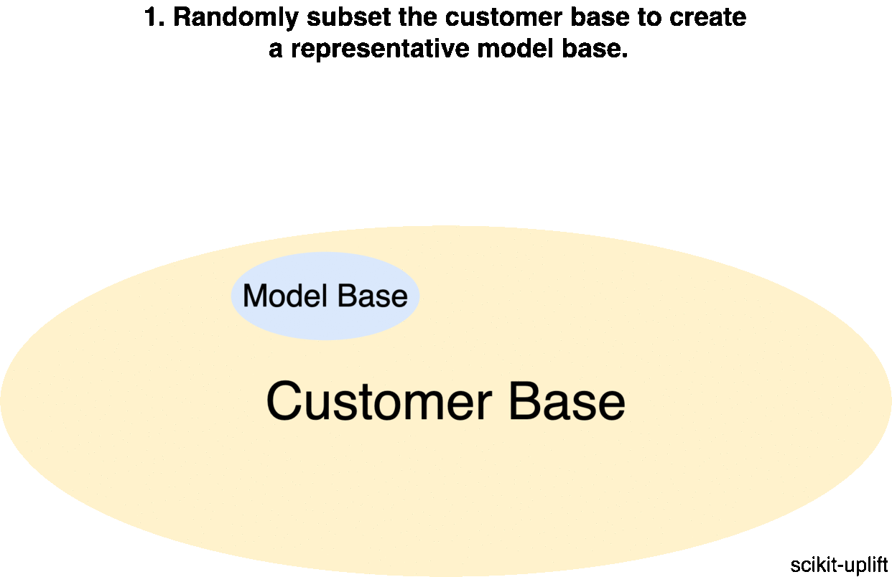

**********************
Data collection
**********************

We need to evaluate a difference between two events that are mutually exclusive for a particular customer (either we communicate with a person, or we don't; you can't do both actions at the same time). This is why there are additional requirements for collecting data when building an uplift model.

There are few additional steps different from a standard data collection procedure. You should run an experiment:

1. Randomly divide a representative part of the customer base into a treatment (receiving communication) and a control (receiving no communication) groups;
2. Evaluate the marketing experiment for the treatment group.

Data collected from the marketing experiment consists of the customer's responses to the marketing offer (target).

The only difference between the experiment and the future uplift model's campaign is a fact that in the first case we choose random customers to make a promotion. In the second case the choice of a customer to communicate with is based on the predicted value returned by the uplift model. If the marketing campaign significantly differs from the experiment used to collect data, the model will be less accurate.

There is a trick: before running the marketing campaign, it is recommended to randomly subset a small part of the customer base and divide it into a control and a treatment group again, similar to the previous experiment. Using this data, you will not only be able to accurately evaluate the effectiveness of the campaign but also collect additional data for a further model retraining.

It is recommended to configure a development of the uplift model and the campaign launch as an iterative process: each iteration will collect new training data. It should consist of a mix of a random customer subset and customers selected by the model.

References
==========

1️⃣ Verbeke, Wouter & Baesens, Bart & Bravo, Cristián. (2018). Profit Driven Business Analytics: A Practitioner's Guide to Transforming Big Data into Added Value.