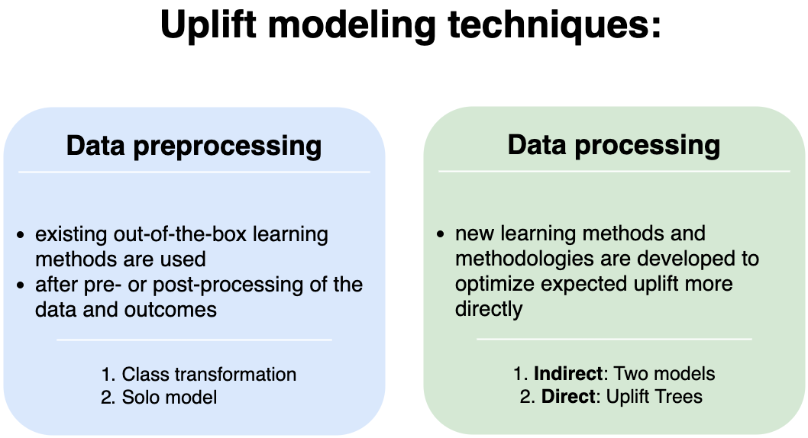

***********************
Approach classification
***********************

Uplift modeling techniques can be grouped into :guilabel:`data preprocessing` and :guilabel:`data processing` approaches.

Data preprocessing
====================

In the :guilabel:`preprocessing` approaches, existing out-of-the-box learning methods are used, after pre- or post-processing of the data and outcomes.

A popular and generic data preprocessing approach is :ref:`the flipped label approach <ClassTransformation>`, also called class transformation approach.

Other data preprocessing approaches extend the set of predictor variables to allow for the estimation of uplift. An example is :ref:`the single model with treatment as feature <SoloModel>`.

Data processing
====================

In the :guilabel:`data processing` approaches, new learning methods and methodologies are developed that aim to optimize expected uplift more directly.

Data processing techniques include two categories: :guilabel:`indirect` and :guilabel:`direct` estimation approaches.

:guilabel:`Indirect` estimation approaches include :ref:`the two-model model approach <TwoModels>`.

:guilabel:`Direct` estimation approaches are typically adaptations from decision tree algorithms. The adoptions include modified the splitting criteria and dedicated pruning techniques.

References
==========

1️⃣ Devriendt, Floris, Tias Guns and Wouter Verbeke. “Learning to rank for uplift modeling.” ArXiv abs/2002.05897 (2020): n. pag.
