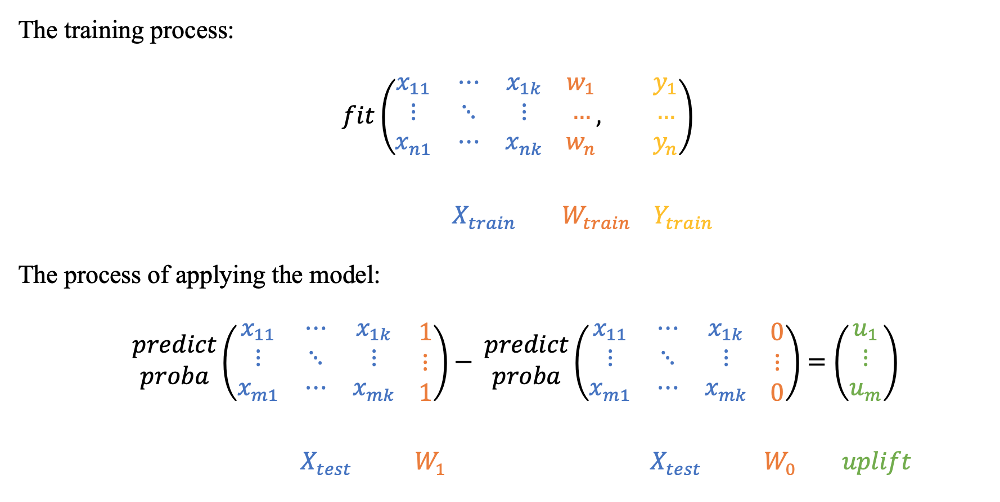

.. _SoloModel:

*********************************
Single model approaches
*********************************

Single model with treatment as feature
========================================

The most intuitive and simple uplift modeling technique. A training set consists of two groups: treatment samples and control samples. There is also a binary treatment flag added as a feature to the training set. After the model is trained, at the scoring time it is going to be applied twice:
with the treatment flag equals `1` and with the treatment flag equals `0`. Subtracting these model's outcomes for each test sample, we will get an estimate of the uplift.

.. hint::
    In sklift this approach corresponds to the  :class:`.SoloModel` class and the **dummy** method.

Treatment interaction
=========================

The single model approach has various modifications. For instance, we can update the number of attributes in the training set by adding
the product of each attribute and the treatment flag:

.. image:: ../../_static/images/SoloModel_treatment_intercation.png
    :align: center
    :alt: Solo model treatment interaction method

.. hint::
    In sklift this approach corresponds to the :class:`.SoloModel` class and the **treatment_interaction** method.

References
==========

1️⃣ Lo, Victor. (2002). The True Lift Model - A Novel Data Mining Approach to Response Modeling in Database Marketing. SIGKDD Explorations. 4. 78-86.

Examples using ``sklift.models.SoloModel``
============================================

.. |Open In Colab1| image:: https://colab.research.google.com/assets/colab-badge.svg
   :target: https://colab.research.google.com/github/maks-sh/scikit-uplift/blob/master/notebooks/RetailHero_EN.ipynb
.. |Open In Colab2| image:: https://colab.research.google.com/assets/colab-badge.svg
   :target: https://colab.research.google.com/github/maks-sh/scikit-uplift/blob/master/notebooks/RetailHero.ipynb

1. The overview of the basic approaches to solving the Uplift Modeling problem

.. list-table::
    :align: center
    :widths: 12 15 10 8

    * - In English 🇬🇧
      - |Open In Colab1|
      - `nbviewer <https://nbviewer.jupyter.org/github/maks-sh/scikit-uplift/blob/master/notebooks/RetailHero_EN.ipynb>`__
      - `github <https://github.com/maks-sh/scikit-uplift/blob/master/notebooks/RetailHero_EN.ipynb>`__
    * - In Russian 🇷🇺
      - |Open In Colab2|
      - `nbviewer <https://nbviewer.jupyter.org/github/maks-sh/scikit-uplift/blob/master/notebooks/RetailHero.ipynb>`__
      - `github <https://github.com/maks-sh/scikit-uplift/blob/master/notebooks/RetailHero.ipynb>`__