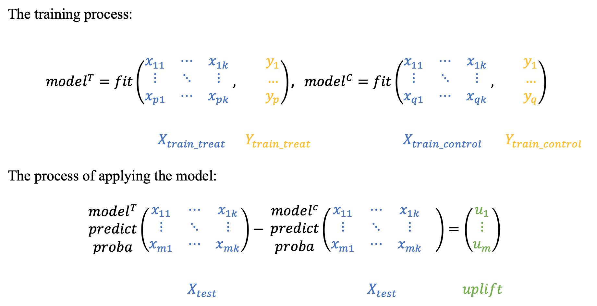
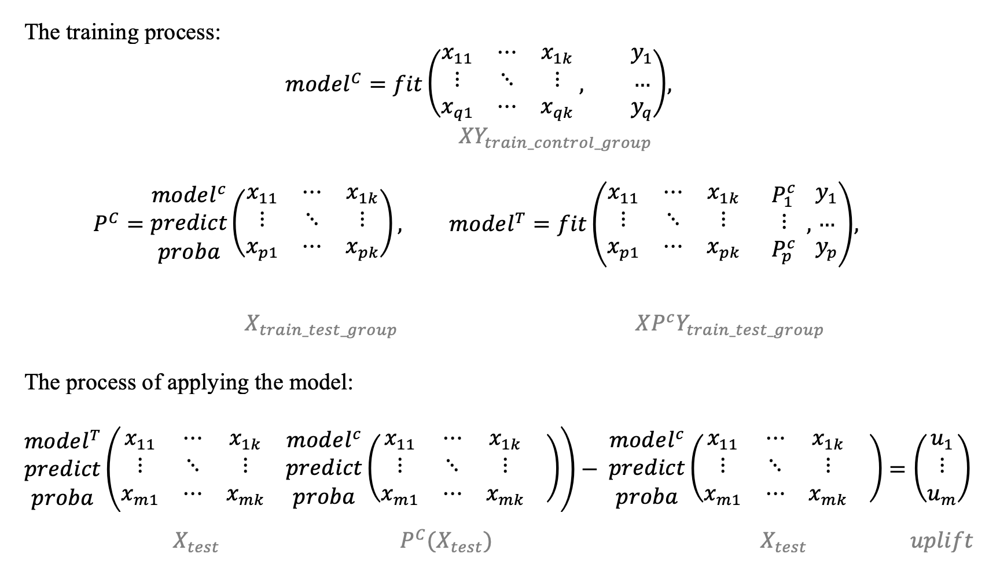

.. _TwoModels:

**************************
Two models approaches
**************************

.. _in the scikit-learn documentation: https://scikit-learn.org/stable/modules/calibration.html

The two models approach can be found in almost every uplift modeling research. It is often used as a baseline model.

Two independent models
==========================

.. hint::
    In sklift this approach corresponds to the :class:`sklift.models.TwoModels` class and the **vanilla** method.

The main idea is to estimate the conditional probabilities of the treatment and control groups separately.

1. Train the first model using the treatment set.
2. Train the second model using the control set.
3. Inference: subtract the control model scores from the treatment model scores.

The main disadvantage of this method is that if the uplift signal is weak, it can be lost since both models focus on predicting an original response, not the uplift.

Two dependent models
========================

The dependent data representation approach is based on the classifier chain method originally developed
for multi-class classification problems. The idea is that if there are :math:`L` different labels, you can build
:math:`L` different classifiers, each of which solves the problem of binary classification and in the learning process,
each subsequent classifier uses the predictions of the previous ones as additional features.
The authors of this method proposed to use the same idea to solve the problem of uplift modeling in two stages.

.. hint::
    In sklift this approach corresponds to the :class:`.TwoModels` class and the **ddr_control** method.

At the beginning we train the classifier based on the control data:

.. math::
    P^C = P(Y=1| X, W = 0),

Next, we estimate the :math:`P_C` predictions and use them as a feature for the second classifier.
It effectively reflects a dependency between treatment and control datasets:

.. math::
    P^T = P(Y=1| X, P_C(X), W = 1)

To get the uplift for each observation, calculate the difference:

.. math::
    uplift(x_i) = P^T (x_i, P_C(x_i)) - P^C(x_i)

Intuitively, the second classifier learns the difference between the expected probability in the treatment and the control sets which is
the uplift.

Similarly, you can first train the :math:`P_T` classifier and then use its predictions as a feature for
the :math:`P_C` classifier.

.. hint::
    In sklift this approach corresponds to the :class:`.TwoModels` class and the **ddr_treatment** method.

There is an important remark about the data nature.
It is important to calibrate model's scores into probabilities if treatment and control data have a different nature.
Model calibration techniques are well described `in the scikit-learn documentation`_.

References
==========

1️⃣ Betlei, Artem & Diemert, Eustache & Amini, Massih-Reza. (2018). Uplift Prediction with Dependent Feature Representation in Imbalanced Treatment and Control Conditions: 25th International Conference, ICONIP 2018, Siem Reap, Cambodia, December 13–16, 2018, Proceedings, Part V. 10.1007/978-3-030-04221-9_5.

2️⃣ Zhao, Yan & Fang, Xiao & Simchi-Levi, David. (2017). Uplift Modeling with Multiple Treatments and General Response Types. 10.1137/1.9781611974973.66.

Examples using ``sklift.models.TwoModels``
============================================

.. |Open In Colab1| image:: https://colab.research.google.com/assets/colab-badge.svg
   :target: https://colab.research.google.com/github/maks-sh/scikit-uplift/blob/master/notebooks/RetailHero_EN.ipynb
.. |Open In Colab2| image:: https://colab.research.google.com/assets/colab-badge.svg
   :target: https://colab.research.google.com/github/maks-sh/scikit-uplift/blob/master/notebooks/RetailHero.ipynb

1. The overview of the basic approaches to solving the Uplift Modeling problem

.. list-table::
    :align: center
    :widths: 12 15 10 8

    * - In English 🇬🇧
      - |Open In Colab1|
      - `nbviewer <https://nbviewer.jupyter.org/github/maks-sh/scikit-uplift/blob/master/notebooks/RetailHero_EN.ipynb>`__
      - `github <https://github.com/maks-sh/scikit-uplift/blob/master/notebooks/RetailHero_EN.ipynb>`__
    * - In Russian 🇷🇺
      - |Open In Colab2|
      - `nbviewer <https://nbviewer.jupyter.org/github/maks-sh/scikit-uplift/blob/master/notebooks/RetailHero.ipynb>`__
      - `github <https://github.com/maks-sh/scikit-uplift/blob/master/notebooks/RetailHero.ipynb>`__